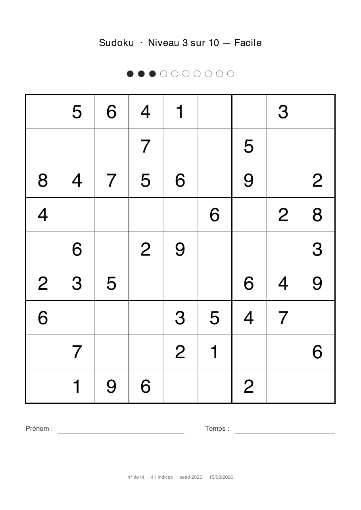

# sudoku-generator

Générateur de sudokus avec **classificateur de difficulté sur 10 niveaux** et sortie **PDF A4**
prête à imprimer.

Le projet vise d'abord un usage familial : produire des grilles calibrées pour des enfants qui
débutent, avec une échelle assez fine pour accompagner leur progression sur la durée.



## Le principe

La difficulté d'un sudoku **ne dépend pas du nombre de cases vides**. Une grille à 24 indices peut
être triviale, une grille à 30 indices peut être redoutable. Ce qui compte, ce sont les **techniques
de résolution nécessaires** pour la terminer.

Le projet s'appuie donc sur deux solveurs distincts :

| Solveur | Rôle |
| --- | --- |
| **Machine** — backtracking à masques de bits | Vérifier qu'une grille admet **exactement une** solution |
| **Humain** — logique déductive à catalogue | Résoudre *comme un joueur*, en journalisant les techniques employées |

C'est le second qui attribue la note.

## L'échelle de difficulté

Le niveau se lit sur la **visibilité** : la part moyenne des cases encore vides qui étaient
immédiatement plaçables à chaque étape. Une grille qui offre à tout instant la moitié de son
reliquat se remplit toute seule ; une grille qui n'en montre qu'un dixième se chasse.

Le **plafond de technique** ne sert qu'à *relever* le niveau : une grille qui force une technique
exigeante ne peut pas être classée facile, même si elle paraît aérée par ailleurs.

| Niv. | Nom | Visibilité | Plancher imposé par la technique | Indices typiques |
| --- | --- | --- | --- | --- |
| 1 | Découverte | ≥ 42 % | — | 50-58 |
| 2 | Premiers pas | ≥ 36 % | — | 44-50 |
| 3 | Facile | ≥ 30 % | — | 40-45 |
| 4 | Facile + | ≥ 25 % | — | 36-41 |
| 5 | Moyen | ≥ 21 % | Chiffre unique ligne/colonne | 33-37 |
| 6 | Moyen + | ≥ 18 % | Case à candidat unique | 31-34 |
| 7 | Confirmé | ≥ 16 % | Candidats verrouillés | 29-32 |
| 8 | Difficile | ≥ 14 % | Paires / triplets, nus et cachés | 27-30 |
| 9 | Expert | < 14 % | X-Wing, XY-Wing | 25-28 |
| 10 | Diabolique | — | Hors catalogue | 22-27 |

Le niveau 10 ne se détecte pas par une technique supplémentaire : c'est le cas où **le catalogue est
épuisé** sans que la grille soit résolue. Les *forcing chains* ne sont donc jamais implémentées.

Les fourchettes d'indices sont indicatives, pas prescriptives : à nombre d'indices constant, la
visibilité varie du simple au double d'une grille à l'autre. Le générateur creuse vers une
fourchette, puis **classe et recommence** si le niveau obtenu n'est pas celui visé.

### Le catalogue de techniques

Le solveur humain les essaie de la moins chère à la plus chère, et **repart toujours du début** dès
qu'une déduction passe — comme un joueur qui, après avoir posé un chiffre, recommence par balayer
les blocs plutôt que par chercher un X-Wing.

| Coût | Technique | Produit |
| --- | --- | --- |
| 10 | Dernière case | placement |
| 20 | Chiffre unique dans un bloc | placement |
| 30 | Chiffre unique dans une ligne ou une colonne | placement |
| 40 | Case à candidat unique | placement |
| 50 | Candidats verrouillés (bloc vers ligne) | élimination |
| 55 | Candidats verrouillés (ligne vers bloc) | élimination |
| 60 | Paire nue | élimination |
| 65 | Paire cachée | élimination |
| 70 | Triplet nu | élimination |
| 75 | Triplet caché | élimination |
| 80 | X-Wing | élimination |
| 85 | XY-Wing | élimination |

Les coûts sont espacés de dix pour pouvoir intercaler une technique sans tout renuméroter.

Une grille de référence existe pour **chacune** : une grille où cette technique est exactement le
plafond, donc où toutes les moins chères s'épuisent et aucune plus chère n'est nécessaire. Elles ont
été trouvées par recherche plutôt que construites à la main :

```bash
uv run python tools/find_fixtures.py
```

Que la recherche aboutisse pour les douze est en soi une information : aucune technique n'est
redondante, et le classement par coût correspond à ce que les grilles exigent réellement.

### D'où viennent ces seuils

Ils sont mesurés, pas devinés. `tools/calibrate.py` creuse un large échantillon de grilles sur toute
la plage 22-58 indices et relève ce qui varie réellement avec la difficulté. Sur 4 000 grilles, deux
des trois métriques prévues à l'origine n'ont pas survécu :

- Le **goulot d'étranglement** — le minimum de coups jouables simultanément — vaut 1 sur la quasi
  totalité des grilles, y compris les plus faciles : il existe presque toujours un moment où un seul
  coup est sur la table. Métrique abandonnée.
- Le **plafond de technique** sature. « Chiffre unique dans un bloc » est le plafond de grilles
  allant de 22 à 58 indices : il ne peut donc pas séparer le bas de l'échelle. Conservé comme
  plancher uniquement.

La visibilité, elle, décroît proprement de 48 % à 54 indices jusqu'à 12 % à 23 indices, et conserve
un écart d'un facteur deux entre quartiles **à nombre d'indices constant** — c'est ce qui distingue
deux grilles semblables sur le papier et très différentes à résoudre.

Mesures refaites une fois les techniques avancées en place. Elles récupèrent une bonne part de ce
qui était insoluble — les grilles hors catalogue passent de 19 % à 11 % de l'échantillon — et
l'échelle reste monotone, si bien que les seuils de visibilité n'ont pas bougé.

Un constat mérite d'être noté : les techniques avancées sont rarement le **plafond** d'une grille.
Sur 2 400 grilles, les candidats verrouillés plafonnent 110 d'entre elles, le XY-Wing 41, et le
X-Wing exactement une. Elles se déclenchent bien plus souvent que ça comme étapes intermédiaires,
mais rarement comme la chose la plus dure qu'une grille exige. Les niveaux 7 à 9 restent donc
portés surtout par la visibilité, le plancher de technique n'intervenant que pour la minorité de
grilles qui tiennent vraiment à un wing ou à une paire verrouillée.

Reproduire les mesures :

```bash
uv run python tools/calibrate.py --per-floor 200 --out sample.csv
```

## Décisions de conception

- **Pas de symétrie** dans le motif des cases vides. C'est une pure convention esthétique de
  magazine, et creuser par paires empêcherait de contrôler le nombre d'indices au chiffre près —
  or c'est le levier principal du réglage des niveaux 1 à 6.
- **Génération ciblée, pas subie.** Creuser ne sait pas viser : à 38 indices, le niveau obtenu va
  de 1 à 8. On creuse donc vers une fourchette, on **classe**, et on recommence si le niveau n'est
  pas le bon — la cible se déplaçant d'un cran dans le sens du manque. Vérifier le plafond de
  technique après *chaque retrait* a été envisagé puis écarté : une résolution logique complète par
  retrait, une cinquantaine par grille, pour un résultat que la boucle d'essais atteint dix fois
  moins cher.
- **Reproductibilité.** Un `random.Random(seed)` passé explicitement partout, jamais le `random`
  global. Même seed, même PDF. La seed est imprimée en pied de page.
- **Rendu découplé.** Une interface `Renderer` isole le format de sortie ; ReportLab n'en est qu'une
  implémentation.

## Installation

```bash
uv sync
```

## Usage

```bash
# Une grille de niveau 4
uv run sudoku generate --niveau 4 -o grille.pdf

# Cinq grilles de niveau 6, avec les solutions, reproductibles
uv run sudoku generate --niveau 6 --nombre 5 --seed 42 --solutions -o grilles.pdf

# Les grilles en texte, pour jeter un œil sans ouvrir de visionneuse
uv run sudoku generate --niveau 3 --format texte -o grilles.txt

# Rappel de l'échelle
uv run sudoku niveaux
```

La commande récapitule ce qu'elle a produit :

```
3 grilles de niveau 4 « Facile + » → grilles.pdf
  n° 3cd0   38 indices   visibilité 28%   seed 2746317213
  n° 9919   38 indices   visibilité 27%   seed 1181241943
  n° f391   38 indices   visibilité 27%   seed 958682846
```

`--seed` rejoue un lot entier à l'identique. Chaque grille porte en plus **sa propre seed** en pied
de page : elle peut être régénérée seule, indépendamment du lot dont elle est issue.

### Carnets

Un carnet monte en difficulté de page en page : les premières grilles mettent en confiance, les
dernières font travailler.

```bash
uv run sudoku carnet --de 3 --a 6 --nombre 20 --joueur "Zoé"
```

```
20 grilles, niveaux 3 à 6 → carnet-zoe-20260815-333-fa38.pdf
  niveau  3 « Facile         »   5 grilles
  ...
  solutions → carnet-zoe-20260815-333-fa38-solutions.pdf
```

**Les solutions sortent dans un document séparé** : le carnet se donne, les réponses restent chez
l'adulte. `--sans-solutions` supprime le second fichier.

`--joueur` inscrit le nom sur la page de garde et sur chaque feuille, ce qui évite de l'écrire vingt
fois. Sans lui, la ligne reste vierge.

Deux carnets tirés avec des seeds différentes n'ont **aucune grille en commun** — de quoi en donner
un à chaque enfant sans qu'ils tombent sur les mêmes.

### Où atterrissent les fichiers

Tout est écrit dans **`out/`**, ignoré par git — ce sont des fichiers générés, et rien d'autre que
la seed ne peut en ramener un une fois effacé. `--dossier` change la destination, `-o` impose un
chemin précis et court-circuite le tout.

Sans `-o`, le nom se construit tout seul :

```
out/carnet-zoe-20260815-111-ecae.pdf
    ▲      ▲    ▲        ▲   ▲
    │      │    │        │   └─ empreinte des grilles
    │      │    │        └───── seed
    │      │    └────────────── date
    │      └─────────────────── joueur (si --joueur)
    └────────────────────────── commande
```

La date et la seed disent d'où vient un fichier ; l'empreinte finale est un condensé des grilles
elles-mêmes. Relancer deux fois la même commande retombe donc sur le **même nom** et réécrit un
fichier identique, tandis que le moindre changement en produit un autre — ce qui garde lisible un
dossier de carnets de test.

## Structure

```
src/sudoku/
├── board.py       représentation, géométrie pré-calculée, candidats en masques de bits
├── solver.py      solveur machine — une solution ? une seule ?
├── techniques.py  les 12 techniques humaines et l'état des candidats
├── human.py       résolution « comme un joueur », avec journal
├── rating.py      journal → niveau de 1 à 10
├── generator.py   creuser, classer, recommencer ; rampes de carnet
├── render/        interface Renderer, sortie PDF (ReportLab) et texte
└── cli.py
tools/
├── calibrate.py     mesure ce qui varie avec la difficulté
└── find_fixtures.py cherche une grille par technique
```

## Performance

Sur un portable, sans parallélisme :

| | |
| --- | --- |
| Test d'unicité d'une grille | 0,1 ms |
| Résolution logique complète | 0,3 à 0,8 ms |
| Une grille de niveau 4 | 12 ms |
| Une grille de niveau 10 | 93 ms |
| Rendu PDF de 20 grilles + solutions | 22 ms |
| **Un carnet de 20 grilles, bout en bout** | **217 ms** |

Le niveau 10 coûte plus cher parce qu'il doit épuiser les douze techniques à chaque étape avant de
conclure que la grille leur échappe.

## Développement

```bash
uv run pytest          # tests
uv run ruff check .    # lint
uv run ruff format .   # formatage
uv run mypy            # typage
```

## Licence

MIT
